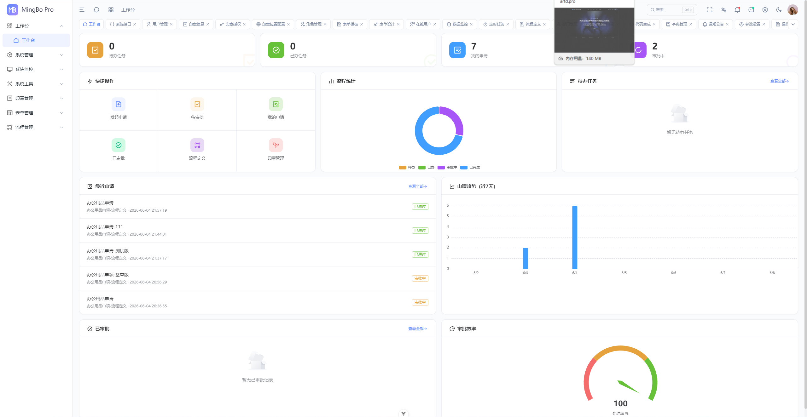
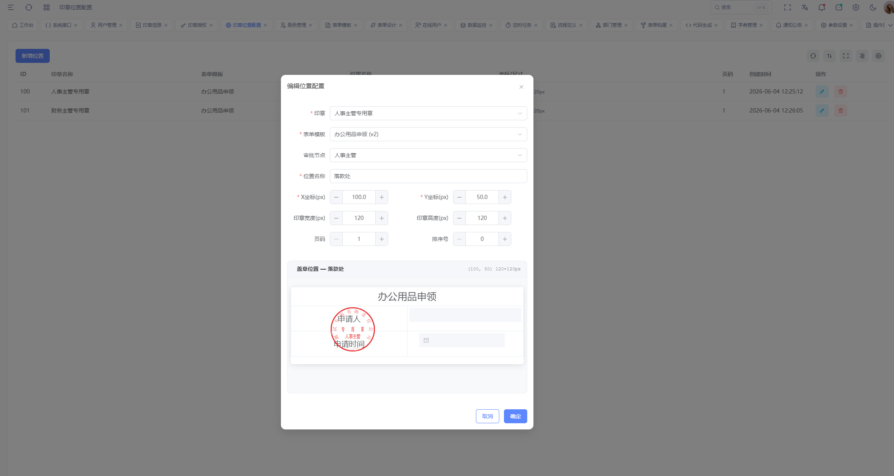
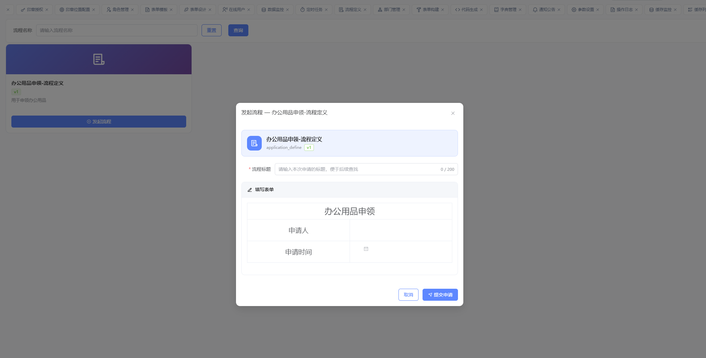
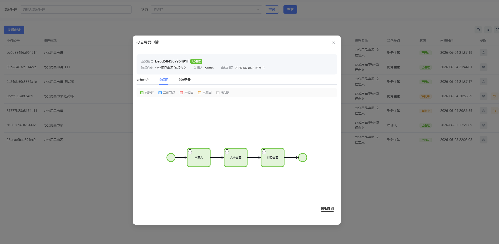

<h1 align="center">MingBo Seal Server</h1>
<p align="center">
  企业级电子签章审批工作流平台 · 后端
</p>
<p align="center">
  基于 Spring Boot 3 + Flowable 流程引擎 + MySQL + Redis 构建
</p>

<div align="center"><a href="./README.md">English</a> | 简体中文</div>

<br />

<div align="center">

[](./LICENSE)
[](https://adoptium.net/)
[](https://spring.io/projects/spring-boot)

</div>

<br />

## 平台简介

MingBo Seal Server（明博签章 · 后端）是 MingBo 品牌下的企业级电子签章审批工作流后端服务，核心能力包括：

- **印章全生命周期管理** — 印章创建、绑定、授权、挂失、销毁的全流程数字化管控
- **审批工作流引擎** — 基于 Flowable BPMN 2.0 的流程设计、流转、会签/或签、条件分支
- **精细化权限体系** — 菜单级、按钮级、数据级三层权限控制，支持 JWT 多终端认证
- **系统监控运维** — 在线用户、服务监控、缓存监控、连接池监控、操作日志一应俱全

> 🔗 **前端配套**: [mingbo-seal-web](https://github.com/ByteSmithJJ/mingbo-seal-web) — Vue 3 + TypeScript + Element Plus

## 技术栈

| 类别 | 技术 |
|------|------|
| 应用框架 | Spring Boot 3.5、Spring Security |
| 流程引擎 | Flowable 7.0（BPMN 2.0） |
| 数据持久层 | MyBatis 3、Druid 连接池、PageHelper 分页 |
| 缓存 | Redis（Lettuce 客户端） |
| 数据库 | MySQL 8.0 |
| 认证鉴权 | JWT（jjwt）、Spring Security |
| API 文档 | SpringDoc / Swagger UI |
| 定时任务 | Quartz |
| 工具库 | Fastjson2、Apache POI、Commons IO、Oshi |
| 构建工具 | Maven 3.8+ |
| 运行环境 | JDK 17+ |

## 系统截图

<table>
  <tr>
    <td></td>
    <td></td>
  </tr>
  <tr>
    <td align="center"><strong>登录页</strong></td>
    <td align="center"><strong>工作台</strong></td>
  </tr>
  <tr>
    <td></td>
    <td></td>
  </tr>
  <tr>
    <td align="center"><strong>印章位置配置</strong></td>
    <td align="center"><strong>表单设计器</strong></td>
  </tr>
  <tr>
    <td></td>
    <td></td>
  </tr>
  <tr>
    <td align="center"><strong>BPMN 流程设计器</strong></td>
    <td align="center"><strong>发起流程</strong></td>
  </tr>
  <tr>
    <td colspan="2"></td>
  </tr>
  <tr>
    <td align="center" colspan="2"><strong>我的申请</strong></td>
  </tr>
</table>

## 模块结构

```
mingbo-seal-server/
├── ruoyi-admin/         # Web 入口层 — Controller、Spring Boot 启动类、YAML 配置
├── ruoyi-framework/     # 框架层 — Security 配置、JWT 过滤器、AOP 切面、全局异常处理
├── ruoyi-system/        # 业务层 — 实体类、Mapper 接口、Service 实现
├── ruoyi-common/        # 通用层 — 注解、枚举、工具类、基础类型（AjaxResult 等）
├── ruoyi-quartz/        # 定时任务模块
├── ruoyi-generator/     # 代码生成器（Velocity 模板）
├── sql/                 # 数据库初始化脚本
└── doc/                 # 设计文档
```

**依赖关系**: `ruoyi-admin` → `ruoyi-framework` → `ruoyi-system` → `ruoyi-common`

## 内置功能

| # | 功能 | 说明 |
|---|------|------|
| 1 | 用户管理 | 系统用户配置，支持多角色 |
| 2 | 部门管理 | 组织机构树形管理，支持数据权限 |
| 3 | 岗位管理 | 用户职务配置 |
| 4 | 菜单管理 | 菜单、按钮权限标识配置 |
| 5 | 角色管理 | 菜单权限分配 + 机构数据范围控制 |
| 6 | 字典管理 | 固定数据字典维护 |
| 7 | 参数管理 | 系统动态参数配置 |
| 8 | 通知公告 | 系统通知信息发布 |
| 9 | 操作日志 | 操作日志记录与查询 |
| 10 | 登录日志 | 登录日志查询（含异常登录） |
| 11 | 在线用户 | 活跃用户状态监控 |
| 12 | 定时任务 | 在线 Cron 任务调度管理 |
| 13 | 代码生成 | 前后端 CRUD 代码一键生成 |
| 14 | API 文档 | Swagger/SpringDoc 自动生成接口文档 |
| 15 | 服务监控 | CPU、内存、磁盘、JVM 实时监控 |
| 16 | 缓存监控 | Redis 缓存信息查询与命令统计 |
| 17 | 连接池监控 | Druid 连接池状态分析与慢 SQL 检测 |
| 18 | 🔐 印章管理 | 印章创建、授权、挂失、销毁 |
| 19 | 📋 审批流程 | Flowable 流程设计、流转、审批 |

## 快速开始

### 环境要求

- **JDK** >= 17
- **Maven** >= 3.8
- **MySQL** >= 8.0
- **Redis** >= 6.0

### 安装步骤

```bash
# 1. 克隆仓库
git clone https://github.com/ByteSmithJJ/mingbo-seal-server.git
cd mingbo-seal-server

# 2. 初始化数据库（按顺序执行）
#    - sql/ry_20260417.sql    基础表结构
#    - sql/quartz.sql          定时任务表
#    - sql/biz_tables.sql      印章审批业务表
#    - flowable-init.sql       流程引擎表（项目根目录）

# 3. 修改数据库/Redis 连接配置
#    编辑 ruoyi-admin/src/main/resources/application.yml
#    编辑 ruoyi-admin/src/main/resources/application-druid.yml

# 4. 编译运行
mvn clean compile
mvn clean package -DskipTests
java -jar ruoyi-admin/target/ruoyi-admin.jar
```

服务启动后访问：
- **API 文档**: http://localhost:8080/swagger-ui.html
- **Druid 控制台**: http://localhost:8080/druid/（默认账号: `ruoyi` / `123456`）

### 环境变量说明

| 配置项 | 位置 | 默认值 | 说明 |
|--------|------|--------|------|
| `server.port` | application.yml | 8080 | 服务端口 |
| `spring.data.redis.host` | application.yml | localhost | Redis 地址 |
| `spring.data.redis.password` | application.yml | (空) | Redis 密码 |
| `token.secret` | application.yml | changeme | JWT 签名密钥 |
| `ruoyi.profile` | application.yml | ./uploadPath | 文件上传路径 |
| 数据库连接 | application-druid.yml | localhost:3306 | MySQL 连接信息 |

> ⚠️ 生产环境部署时，请务必修改 `token.secret`、数据库密码和 Redis 密码。

## 鸣谢

本项目基于以下优秀的开源项目构建，谨此致谢：

| 项目 | 用途 | 许可证 |
|------|------|--------|
| **[RuoYi-Vue (若依)](https://gitee.com/y_project/RuoYi-Vue)** | 底层快速开发框架 | MIT |
| **[Flowable](https://github.com/flowable/flowable-engine)** | BPMN 2.0 工作流引擎 | Apache 2.0 |
| **[Spring Boot](https://github.com/spring-projects/spring-boot)** | Java 应用框架 | Apache 2.0 |
| **[Spring Security](https://github.com/spring-projects/spring-security)** | 安全认证框架 | Apache 2.0 |
| **[MyBatis](https://github.com/mybatis/mybatis-3)** | 持久层框架 | Apache 2.0 |
| **[Druid](https://github.com/alibaba/druid)** | 数据库连接池 | Apache 2.0 |
| **[Redis](https://redis.io/)** | 内存数据库（缓存） | BSD |
| **[MySQL](https://www.mysql.com/)** | 关系型数据库 | GPL |
| **[jjwt](https://github.com/jwtk/jjwt)** | JWT 令牌生成与解析 | Apache 2.0 |
| **[PageHelper](https://github.com/pagehelper/Mybatis-PageHelper)** | MyBatis 分页插件 | MIT |
| **[SpringDoc](https://github.com/springdoc/springdoc-openapi)** | OpenAPI/Swagger 文档 | Apache 2.0 |
| **[Quartz](http://www.quartz-scheduler.org/)** | 定时任务调度 | Apache 2.0 |
| **[Fastjson2](https://github.com/alibaba/fastjson2)** | JSON 解析器 | Apache 2.0 |
| **[Oshi](https://github.com/oshi/oshi)** | 系统信息监控 | MIT |
| **[Kaptcha](https://github.com/lingochamp/kaptcha)** | 验证码生成 | Apache 2.0 |

> 特别感谢 **RuoYi-Vue** 项目及其社区，为本项目提供了坚实的底层架构基础。

## 贡献

欢迎贡献！请参阅 [CONTRIBUTING.md](./CONTRIBUTING.md) 了解开发规范和 PR 流程。

## 许可证

本项目基于 [MIT License](./LICENSE) 开源。部分代码来源于 RuoYi-Vue（Copyright © 2018 RuoYi），在 MIT 许可下使用。

## Star 历史

[](https://www.star-history.com/#ByteSmithJJ/mingbo-seal-server&Date)
